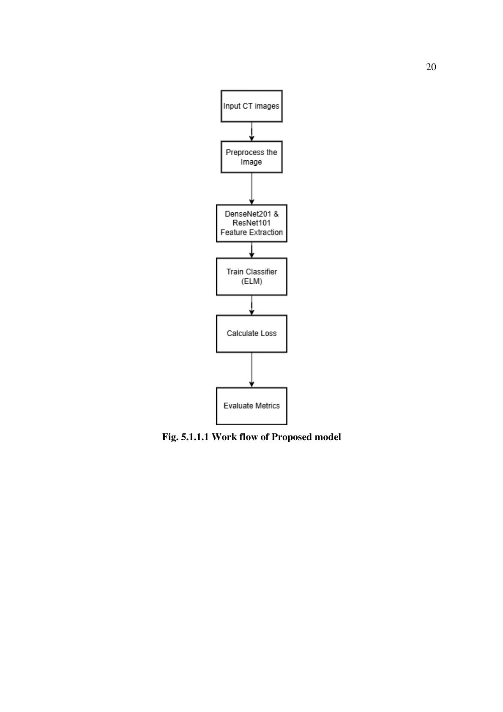
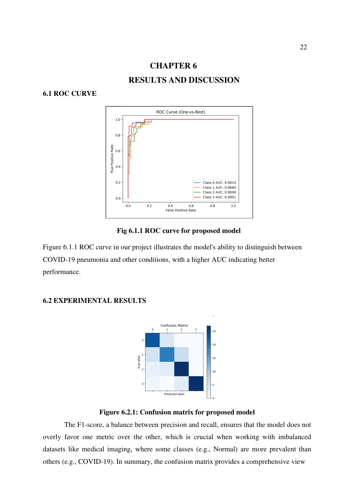
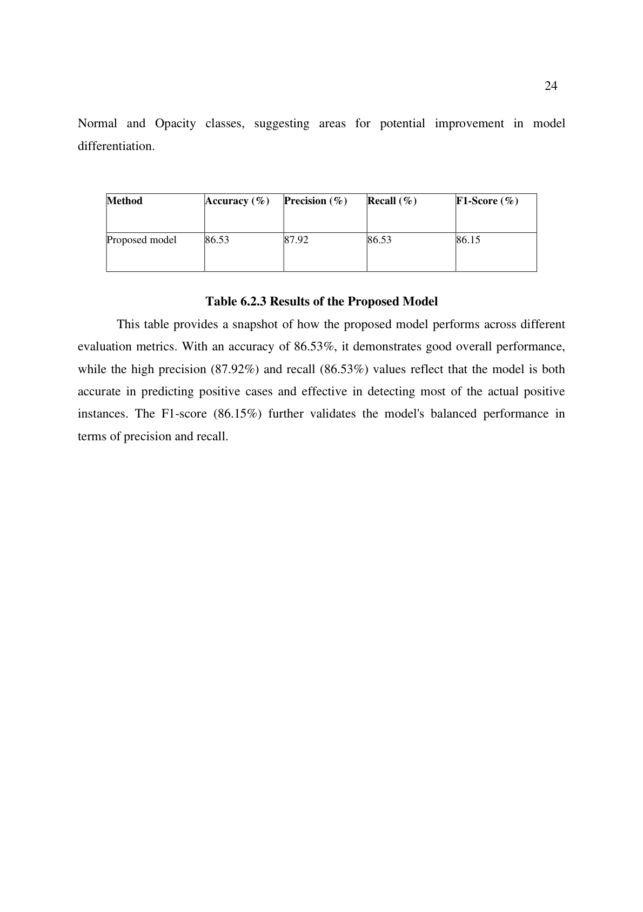

# COVID-19 Pneumonia Classification Using Chest CT Images

This repository presents a deep-learning workflow for **multi-class chest CT image classification**.  
The model predicts one of the following classes:

- **COVID-19**
- **Normal**
- **Viral Pneumonia**
- **Lung Opacity**

The core idea is a **hybrid transfer-learning model**:

- **ResNet18** for feature extraction
- **Extreme Learning Machine (ELM)** style classifier head for final prediction
- Combined optimization using **classification**, **domain**, and **diversity** losses

---

## Table of Contents

- [Project Objective](#project-objective)
- [What Is in This Repository](#what-is-in-this-repository)
- [Technical Approach](#technical-approach)
- [Training and Evaluation Pipeline](#training-and-evaluation-pipeline)
- [Requirements](#requirements)
- [Dataset Layout](#dataset-layout)
- [How to Run](#how-to-run)
- [Expected Outputs](#expected-outputs)
- [Report Screenshots](#report-screenshots)
- [References](#references)

---

## Project Objective

Early and accurate CT-based detection support can help clinical decision-making for respiratory infections.  
This project focuses on creating a robust classifier that distinguishes COVID-19 from other similar lung conditions using transfer learning.

---

## Project Overview

This project implements a **Hybrid Deep Transfer Learning Model with Kernel Metric** for the classification of COVID-19 pneumonia using chest CT images.  
The approach follows the paper **"A Hybrid Deep Transfer Learning Model With Kernel Metric for COVID-19 Pneumonia Classification Using Chest CT Images"** and targets four classes:

- COVID-19
- Viral Pneumonia
- Lung Opacity
- Normal

### Key Features

- **ResNet18 Feature Extractor**: Fine-tuned for richer CT feature representations.
- **Extreme Learning Machine (ELM) Classifier**: Used to improve classification performance.
- **Dual ELM Setup**: Training flow includes two ELM classifiers (baseline notebook uses hidden size 1000).
- **Hybrid Learning Objective**: Combines classification loss, domain loss, and diversity loss.
- **Evaluation Metrics**: Precision, Recall, F1-score, and AUC.

---

## What Is in This Repository

```text
Covid-19-Detection/
├── README.md
├── Report.pdf
├── Manuscript.pdf
├── A_Hybrid_Deep_Transfer_Learning_Model_With_Kernel_Metric_for_COVID-19_Pneumonia_Classification_Using_Chest_CT_Images.pdf
├── covid detection using resnet18.ipynb   # Baseline training/evaluation notebook
├── detect image.ipynb                     # Enhanced variant with extra augmentation/tuning
├── newppt.pptx
└── assets/
    └── report-screenshots/
        ├── workflow.png
        ├── roc_curve.png
        └── results_table.png
```

Notebook summary:

- **`covid detection using resnet18.ipynb`**
  - ResNet18 feature extractor
  - ELM hidden layer size: **1000**
  - Adam optimizer, LR scheduler (`StepLR`)
  - Typical training configuration: batch size **32**, epochs **30**

- **`detect image.ipynb`**
  - Additional image augmentation (flip, rotation, color jitter)
  - ELM hidden layer size: **2000** + BatchNorm
  - Adam optimizer with weight decay
  - Typical training configuration: batch size **32**, epochs **50**

---

## Technical Approach

### 1) Data Processing

- CT images are loaded with `torchvision.datasets.ImageFolder`
- Images are resized to **224×224**
- Dataset is split into training and validation subsets (80/20)

### 2) Feature Extraction

- Pretrained **ResNet18** backbone from `torchvision.models`
- Final fully-connected classification layer is replaced by `Identity`
- Output deep feature vector feeds the classifier module

### 3) Classification Module (ELM-style)

- Fully connected hidden layer (1000/2000 neurons depending on notebook)
- Output layer predicts the 4 disease classes
- Two ELM classifier instances are created in the training flow

### 4) Loss Design

Training combines:

- **Classification loss** (`CrossEntropyLoss`) for supervised prediction
- **Domain loss** (`MSE`) to align feature distributions
- **Diversity loss** to encourage less degenerate predictions

### 5) Evaluation Metrics

- Accuracy
- Precision (weighted)
- Recall (weighted)
- F1-score (weighted)
- ROC-AUC (one-vs-rest)
- ROC curve plots per class

---

## Training and Evaluation Pipeline

1. Configure dataset path in notebook (`data_dir`).
2. Load and preprocess images.
3. Train feature extractor + ELM classifier for selected epochs.
4. Run validation to compute metrics and class probabilities.
5. Plot ROC curves and review confusion/summary tables from report.

---

## Requirements

Recommended: **Python 3.9+**

Install required packages:

```bash
pip install torch torchvision scikit-learn matplotlib pillow
```

---

## Dataset Layout

Organize your dataset folders like this:

```text
dataset_root/
├── COVID/
├── Normal/
├── Viral Pneumonia/
└── Lung Opacity/
```

> Important: The notebooks currently contain a hardcoded path (`C:/Users/HP/Desktop/SAMPLE`).  
> Change `data_dir` to your local dataset location before training.

---

## Note on Current Repository Structure

This repository currently contains **notebooks** for training/evaluation, not a `main.py` + `model.py` script layout.  
So the active structure in this branch is notebook-based (`covid detection using resnet18.ipynb`, `detect image.ipynb`) with report assets under `assets/report-screenshots/`.

---

## How to Run

### Option A: Baseline notebook

Open and run:

- `covid detection using resnet18.ipynb`

### Option B: Enhanced notebook

Open and run:

- `detect image.ipynb`

For both options:

1. Update `data_dir`
2. Run all cells in order
3. Inspect printed metrics and generated ROC plots

---

## Expected Outputs

After training/validation, you should see:

- epoch-wise training losses
- final validation metrics (precision, recall, F1, AUC)
- ROC curves for all classes
- comparative result tables (see report screenshots below)

---

## Report Screenshots

### 1) Proposed Model Workflow (from `Report.pdf`)



### 2) ROC Curve (from `Report.pdf`)



### 3) Experimental Results Table (from `Report.pdf`)



---

## References

- Project report: `Report.pdf`
- Manuscript: `Manuscript.pdf`
- Base paper: `A_Hybrid_Deep_Transfer_Learning_Model_With_Kernel_Metric_for_COVID-19_Pneumonia_Classification_Using_Chest_CT_Images.pdf`
